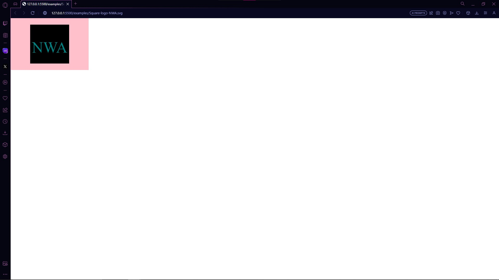
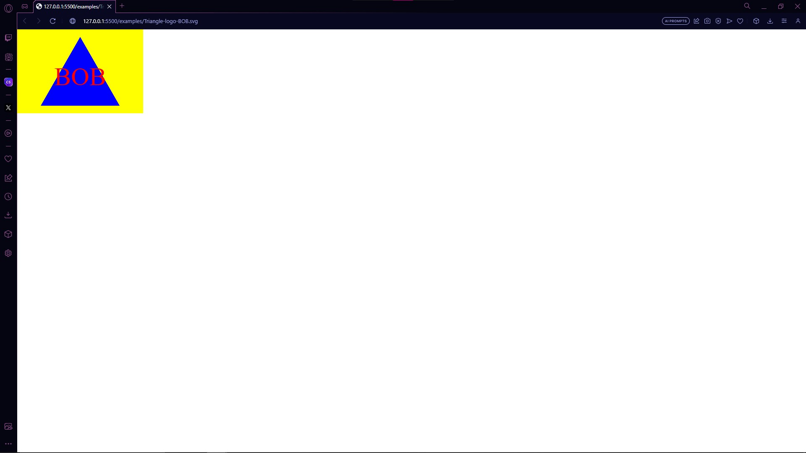

# SVG LOGO MAKER  

## Table of Contents
  * [Description](#description)
  * [Installation](#installation)
  * [Executing-Program](###Executing-Program)
  * [Demonstration](###Demonstration)
  * [Questions](#questions)
  * [License](#license)
  


## Description:
  This code allows the user to create small logos with simple code to back it up. You are able to choose the background shape and add color to the shape. You can add up 3 characters of text to add inside the shape along with the color of the text.

## Getting Started

### Installation
*  Run this code in the terminal under the index.js
```
   npm i -y
```
```
   npm i inquirer@8.2.4
```
```
  npm i --save-dev jest
```


### Executing-Program

* Run the command in the Terminal under the index.js to check if everything works
```
   npm run test
```
 Then run this command to start the code
```
   npm start
```
### Demonstration




[SVG LOGO MAKER DEMO](https://drive.google.com/file/d/1RPzbUTGCV9R7izlytO4QPxh07ZgKMP4D/view)


### Questions
* Github: MijitoJuanito
* Email: j.v.delcruz70120@gmail.com


## Authors


Juan De La Cruz  


## License

MIT License

Copyright (c) 2023 MijitoJuanito

Permission is hereby granted, free of charge, to any person obtaining a copy
of this software and associated documentation files (the "Software"), to deal
in the Software without restriction, including without limitation the rights
to use, copy, modify, merge, publish, distribute, sublicense, and/or sell
copies of the Software, and to permit persons to whom the Software is
furnished to do so, subject to the following conditions:

The above copyright notice and this permission notice shall be included in all
copies or substantial portions of the Software.

THE SOFTWARE IS PROVIDED "AS IS", WITHOUT WARRANTY OF ANY KIND, EXPRESS OR
IMPLIED, INCLUDING BUT NOT LIMITED TO THE WARRANTIES OF MERCHANTABILITY,
FITNESS FOR A PARTICULAR PURPOSE AND NONINFRINGEMENT. IN NO EVENT SHALL THE
AUTHORS OR COPYRIGHT HOLDERS BE LIABLE FOR ANY CLAIM, DAMAGES OR OTHER
LIABILITY, WHETHER IN AN ACTION OF CONTRACT, TORT OR OTHERWISE, ARISING FROM,
OUT OF OR IN CONNECTION WITH THE SOFTWARE OR THE USE OR OTHER DEALINGS IN THE
SOFTWARE.


